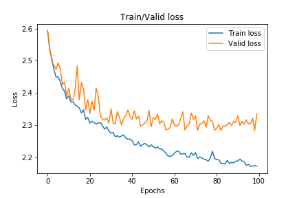
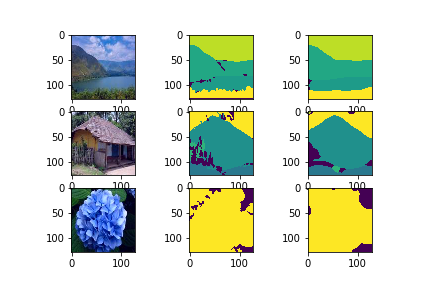

# Outdoor-semanticSegmentation
This repo contains a notebook that shows how we can use Deeplabv3 implemented in Pytorch to train a custom dataset.
The dataset I used in this notebook was very small, imbalanced and noisy. However the model was able to find some patterns.
### Training Stats

### Inferences
Image order: [inputImage groundTruth preditction]

